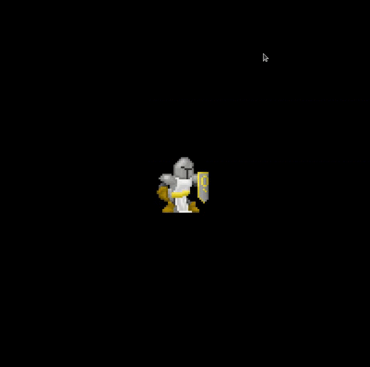

# SFML
Implementation of a game engine in sfml

main features:

* Automatic ressource/memory management
* StateManager / State Stack
* EventManager / Binding from file
* DataDriven 
* SpriteSheet / animations

